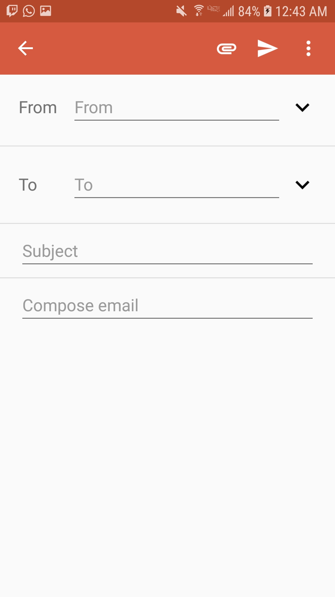
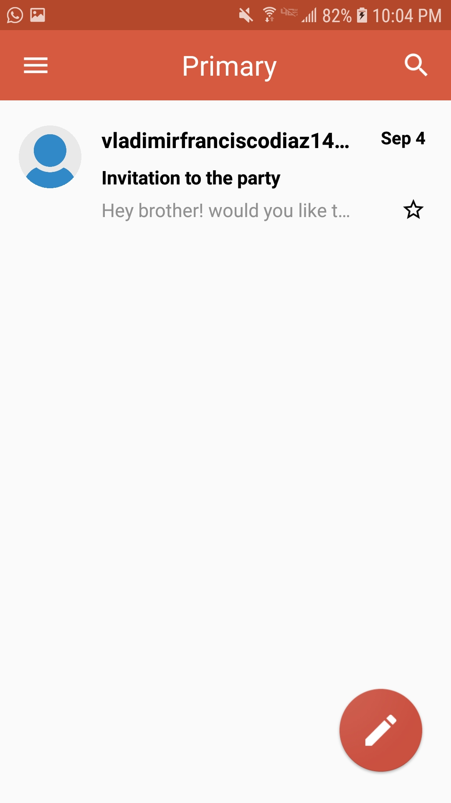
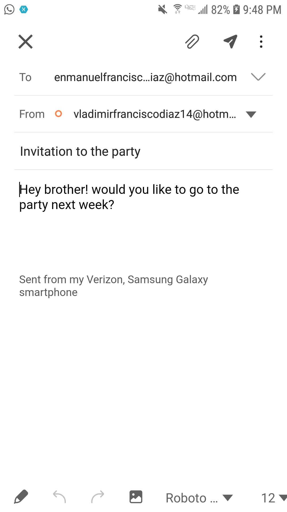
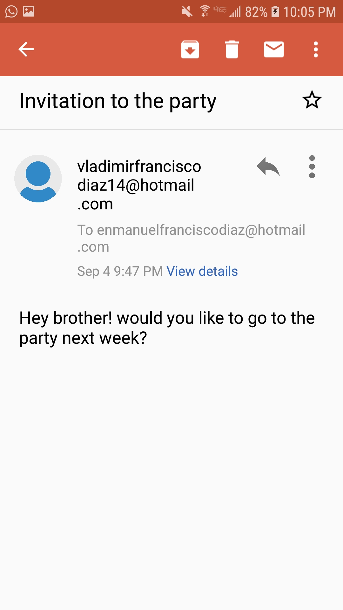
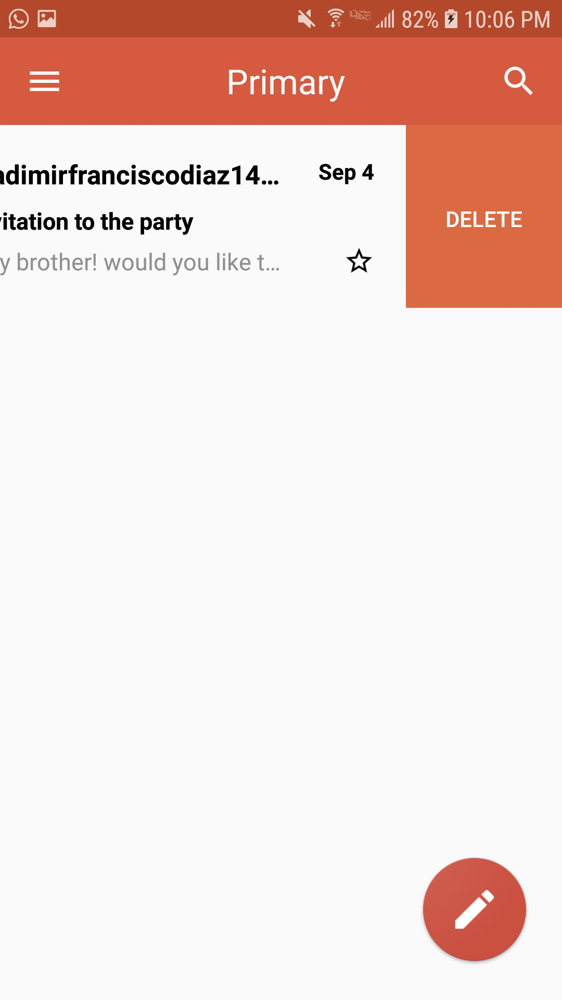

# Email app simulation that resembles de Gmail mobile user interface.

# Main functionalities:
- You can create Emails and list them in the home page
- You can view the details of each email in a new page
- You can favorute an email from the home page
- You can delete emails in the home page

# Characteristics:
- Data is preserved even when closing the app
- When clicking on the send email icon, a local notification pops up saying "Your email has been sent!"
- When clicking on the send email icon, the operative system email app opens up on the compose email page, with the fields "Subject", "Body" and the list destinataries pre-filled.

# Screenshots of the app:

